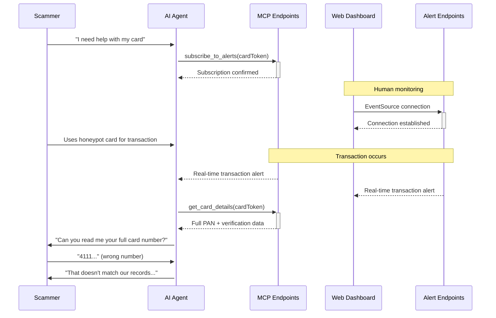

# Honeypot Transaction Monitoring System - API Endpoints Guide

## Overview

The Honeypot Transaction Monitoring System provides **two distinct endpoint systems** designed for different client types and use cases. This guide explains the purpose, protocols, and appropriate usage of each system.

## Endpoint Systems Summary

| System | Purpose | Protocol | Clients | Authentication |
|--------|---------|----------|---------|----------------|
| **MCP Endpoints** | AI Agent Communication | JSON-RPC 2.0 | Conversational AI Agents | Bearer Token |
| **Alert Endpoints** | Human Interface Streaming | Server-Sent Events | Web UI, Browsers | Web Token |

---

## 🤖 MCP (Model Context Protocol) Endpoints

### Purpose
**AI-to-System communication for intelligent transaction analysis and real-time alerts during scammer interactions.**

### Base URL
```
POST /api/mcp/query
```

### Target Clients
- **Conversational AI Agents** - During live scammer phone calls
- **Conversational AI Systems** - For dynamic transaction verification
- **Automated Fraud Detection** - For pattern analysis and risk assessment

### Protocol: JSON-RPC 2.0
```json
{
  "jsonrpc": "2.0",
  "method": "query",
  "params": {
    "tool": "search_transactions",
    "query": "Show me transactions from today",
    "limit": 10
  },
  "id": "req_123"
}
```

### Authentication
```http
Authorization: Bearer your_api_token_here
Content-Type: application/json
```

### Available Tools (17 total)
1. **Real-Time Alert Tools**
   - `subscribe_to_alerts` - Subscribe to real-time transaction alerts
   - `unsubscribe_from_alerts` - Clean unsubscription
   - `get_subscription_status` - Connection health monitoring

2. **Transaction Intelligence Tools**
   - `search_transactions` - Natural language transaction queries
   - `get_transaction_details` - Comprehensive transaction data
   - `get_recent_transactions` - Latest transactions with analysis
   - `get_merchant_info` - Merchant intelligence

3. **Enhanced Card Access Tools** ⚠️ **SENSITIVE**
   - `list_available_cards` - List honeypot cards for testing
   - `get_card_details` - **Complete card info including PAN**
   - `get_card_info` - Enhanced card information

### Example Use Case: AI Agent During Scammer Call
```javascript
// AI agent receives real-time transaction alert
// Then queries for verification data
{
  "jsonrpc": "2.0",
  "method": "query", 
  "params": {
    "tool": "get_card_details",
    "cardToken": "card_honeypot_123"
  }
}

// Response includes full PAN for scammer verification
{
  "result": {
    "cardDetails": {
      "pan": "4111111111111234", // SENSITIVE - for verification
      "verificationQuestions": [
        "What's the full card number you're using?"
      ]
    }
  }
}
```

---

## 🌐 Alert (SSE) Endpoints  

### Purpose
**Human-accessible real-time monitoring interfaces for development, testing, and administrative oversight.**

### Base URL
```
GET /api/alerts/stream/:cardToken
```

### Target Clients
- **Web Dashboard** - Browser-based monitoring interface
- **Development Tools** - Testing and simulation interfaces  
- **Administrative Monitoring** - Human oversight of AI agent activity
- **EventSource API** - Browser-native real-time connections

### Protocol: Server-Sent Events (SSE)
```javascript
// Browser EventSource API
const eventSource = new EventSource('/api/alerts/stream/card_123?agentId=web_user&token=web-interface-token-123');

eventSource.addEventListener('transaction', function(event) {
  const alert = JSON.parse(event.data);
  console.log('New transaction:', alert);
});
```

### Authentication
```javascript
// Query parameter authentication for web interfaces
?token=web-interface-token-timestamp-random
?agentId=web_user_123
```

### Event Types
```javascript
// Connection establishment
event: welcome
data: {"sessionId":"uuid","status":"connected"}

// Real-time transaction alerts  
event: transaction
data: {"alertType":"NEW_TRANSACTION","amount":"$12.45","merchant":"Starbucks"}

// System status updates
event: connection
data: {"status":"active","heartbeat":"ok"}
```

### Example Use Case: Web Interface Monitoring
```html
<!-- Frontend simulation interface -->
<script>
const eventSource = new EventSource(`/api/alerts/stream/${cardToken}?agentId=${sessionId}&token=${webToken}`);

eventSource.onmessage = function(event) {
  const alertData = JSON.parse(event.data);
  updateTransactionDisplay(alertData);
};
</script>
```

---

## 🔄 System Interaction Flow

### Scenario: Scammer Verification Call


---

## 🔐 Security Considerations

### MCP Endpoints (HIGH SECURITY)
- ✅ **Bearer Token Authentication** - Enterprise-grade API tokens
- ✅ **PAN Access Logging** - All sensitive data access logged with HIGH sensitivity
- ✅ **Rate Limiting** - Protection against abuse
- ✅ **Request ID Tracking** - Complete audit trails
- ✅ **IP Logging** - Security monitoring

### Alert Endpoints (MODERATE SECURITY)  
- ✅ **Web Token Authentication** - Simplified for browser access
- ✅ **Session Management** - UUID-based session tracking
- ✅ **Connection Monitoring** - Health checks and cleanup
- ✅ **CORS Headers** - Proper cross-origin configuration
- ✅ **Request Logging** - Activity monitoring

---

## 🚀 When to Use Which Endpoint

### Use MCP Endpoints When:
- ✅ **Building AI agents** that need structured transaction data
- ✅ **Integrating with conversational AI platforms** like Vapi, OpenAI, or custom agents
- ✅ **Requiring card PAN access** for scammer verification scenarios
- ✅ **Needing complex queries** with natural language processing
- ✅ **Building automated systems** for fraud detection

### Use Alert Endpoints When:
- ✅ **Creating web dashboards** for human monitoring
- ✅ **Building browser-based tools** using EventSource API
- ✅ **Developing testing interfaces** for the honeypot system
- ✅ **Setting up real-time monitoring** for development/staging
- ✅ **Creating administrative oversight** tools

---

## 📝 Integration Examples

### MCP Integration (AI Agent)
```javascript
// AI agent integration
class HoneypotAIAgent {
  async subscribeToAlerts(cardTokens) {
    const response = await fetch('/api/mcp/query', {
      method: 'POST',
      headers: {
        'Authorization': 'Bearer ' + this.apiToken,
        'Content-Type': 'application/json'
      },
      body: JSON.stringify({
        jsonrpc: '2.0',
        method: 'query',
        params: {
          tool: 'subscribe_to_alerts',
          agentId: this.agentId,
          cardTokens: cardTokens
        },
        id: 'subscribe_' + Date.now()
      })
    });
    
    return response.json();
  }
  
  async verifyScammerCard(cardToken) {
    // Get full card details including PAN
    const cardData = await this.queryMCP('get_card_details', { cardToken });
    
    // Use PAN for scammer verification
    return cardData.result.scammerVerification;
  }
}
```

### SSE Integration (Web Interface)
```javascript
// Web interface integration
class HoneypotWebMonitor {
  connectToAlerts(cardToken) {
    const agentId = 'web_' + Date.now();
    const webToken = `web-interface-token-${Date.now()}-${Math.random().toString(36).substr(2, 9)}`;
    
    this.eventSource = new EventSource(
      `/api/alerts/stream/${cardToken}?agentId=${agentId}&token=${webToken}`
    );
    
    this.eventSource.addEventListener('transaction', (event) => {
      const alert = JSON.parse(event.data);
      this.displayTransaction(alert);
    });
    
    this.eventSource.addEventListener('welcome', (event) => {
      const welcome = JSON.parse(event.data);
      console.log('Connected with session:', welcome.sessionId);
    });
  }
  
  displayTransaction(alert) {
    // Update web dashboard with new transaction
    const transactionElement = document.createElement('div');
    transactionElement.innerHTML = `
      <strong>${alert.immediate.merchant}</strong>: ${alert.immediate.amount}
      <br>Location: ${alert.immediate.location}
      <br>Time: ${alert.timestamp}
    `;
    document.getElementById('transactions').appendChild(transactionElement);
  }
}
```

---

## 🔧 Development and Testing

### Local Development Setup
```bash
# Start the server
npm start

# Test MCP endpoint
curl -X POST http://localhost:3000/api/mcp/query \
  -H "Authorization: Bearer test_token" \
  -H "Content-Type: application/json" \
  -d '{"jsonrpc":"2.0","method":"query","params":{"tool":"list_available_cards"},"id":"test"}'

# Test Alert endpoint (browser)
# Open: http://localhost:3000/frontend/public/simulation-interface.html
```

### Testing Tools
- **MCP Testing**: Use JSON-RPC 2.0 clients or curl commands
- **SSE Testing**: Use browser EventSource API or SSE client libraries
- **Web Interface**: Built-in simulation interface at `/frontend/public/simulation-interface.html`

---

## 📊 Monitoring and Analytics

Both endpoint systems provide comprehensive monitoring:

### MCP Endpoints Metrics
- Request counts and success rates
- Tool usage statistics  
- Authentication failures
- Response times and performance

### Alert Endpoints Metrics
- Active SSE connections
- Message delivery rates
- Connection health scores
- Session duration analytics

Access metrics via:
```javascript
// MCP connection stats
GET /api/mcp/connection-stats

// Alert connection stats  
GET /api/alerts/connection-stats
```

---

## 🆘 Troubleshooting

### Common MCP Issues
- **Authentication Errors**: Verify Bearer token format and validity
- **JSON-RPC Errors**: Check request format matches JSON-RPC 2.0 spec
- **Tool Not Found**: Verify tool name matches available tools list

### Common SSE Issues
- **Connection Drops**: Check network stability and proxy settings
- **CORS Errors**: Verify origin headers and server CORS configuration
- **Authentication Failures**: Check web token format and query parameters

### Debug Endpoints
```javascript
// Health checks
GET /api/mcp/health
GET /api/alerts/health

// Connection diagnostics
GET /api/alerts/connection-stats
GET /api/mcp/connection-stats
```

---

## 📚 Additional Resources

- **SYSTEM_OVERVIEW.md** - Complete system architecture documentation
- **REFACTOR_PLAN.md** - Development roadmap and architectural decisions
- **Frontend Interface** - `/frontend/public/simulation-interface.html`
- **Test Suites** - `/tests/` directory for comprehensive testing examples

---

*This documentation clarifies that both endpoint systems serve legitimate, complementary purposes and should be maintained as part of the enterprise-grade honeypot monitoring system.* 